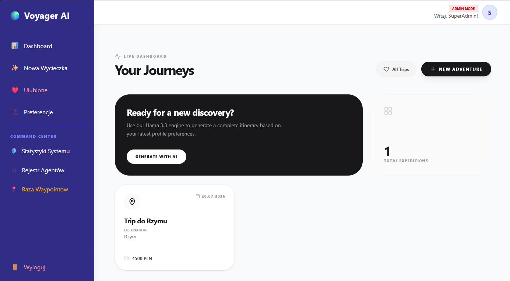
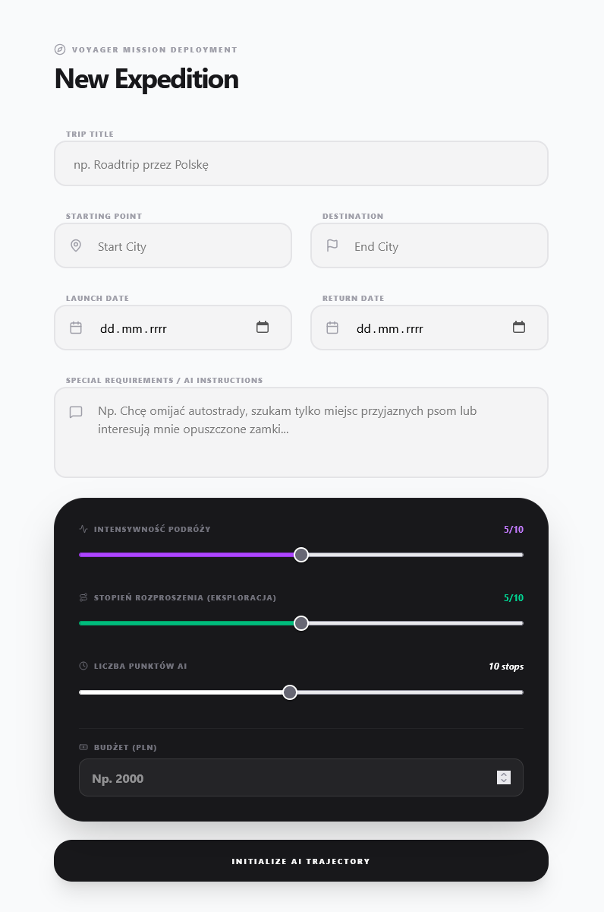
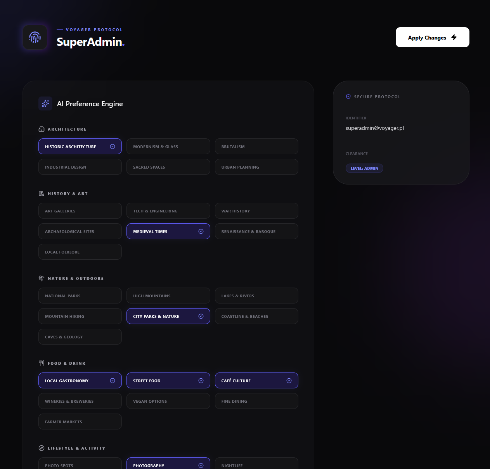
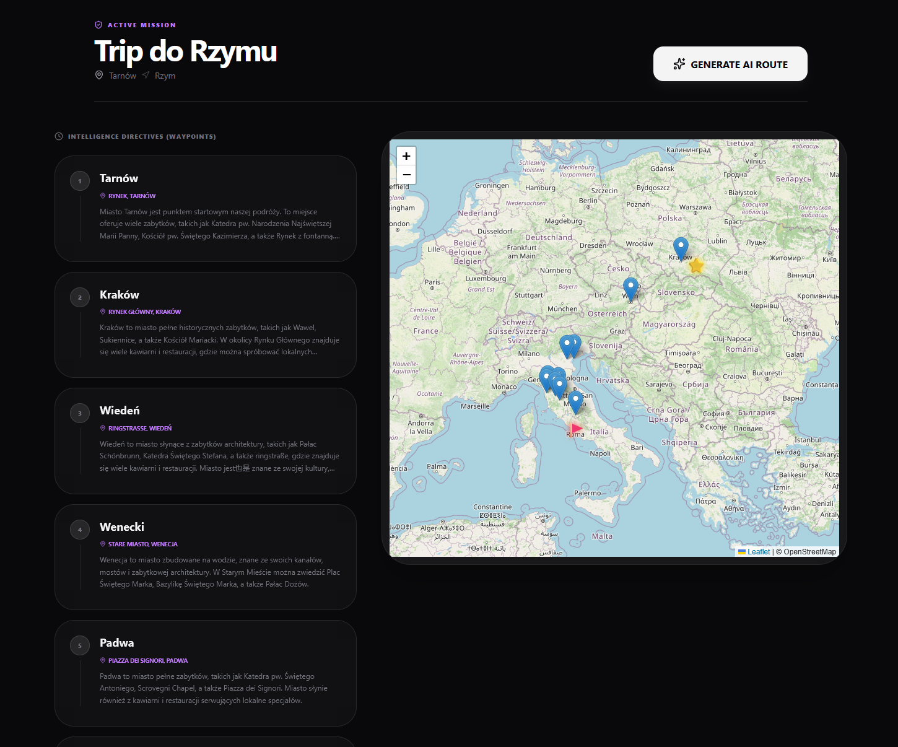
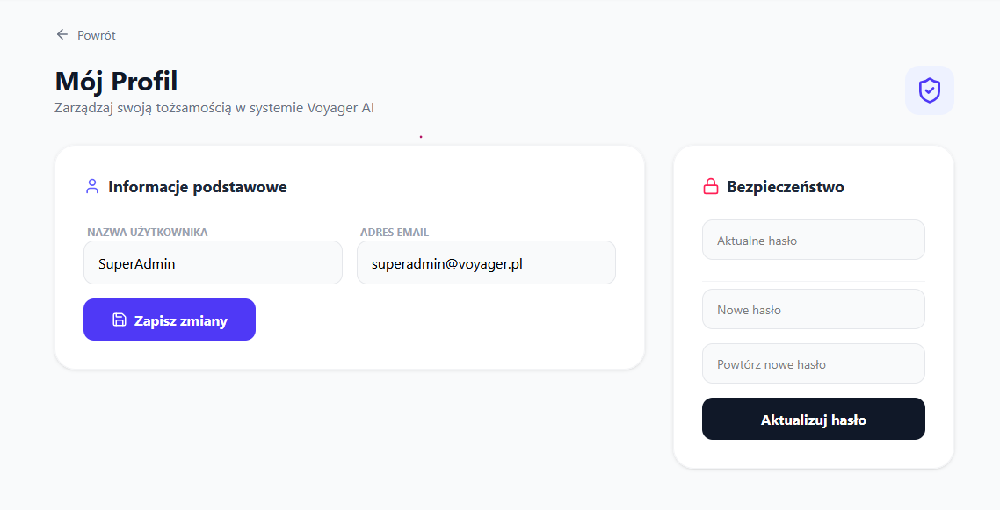
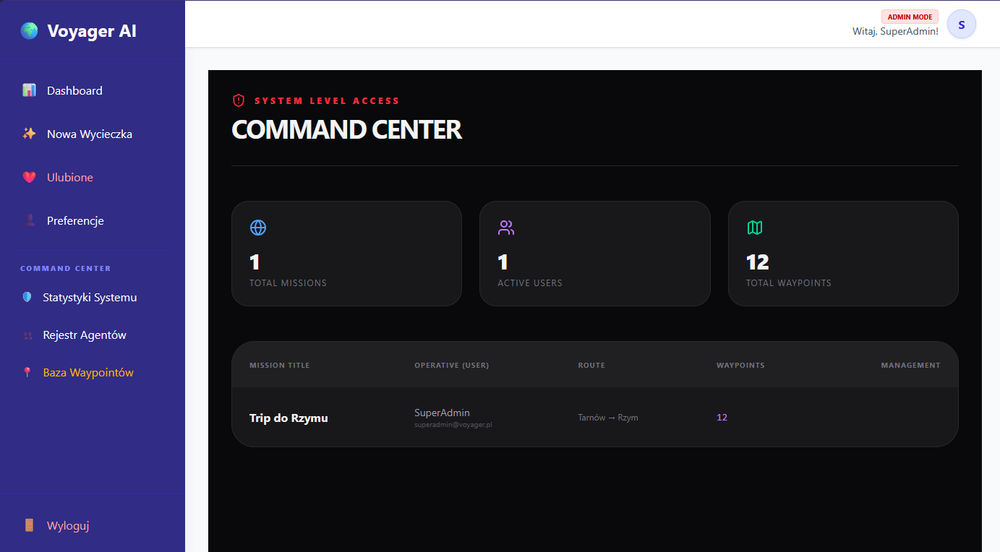
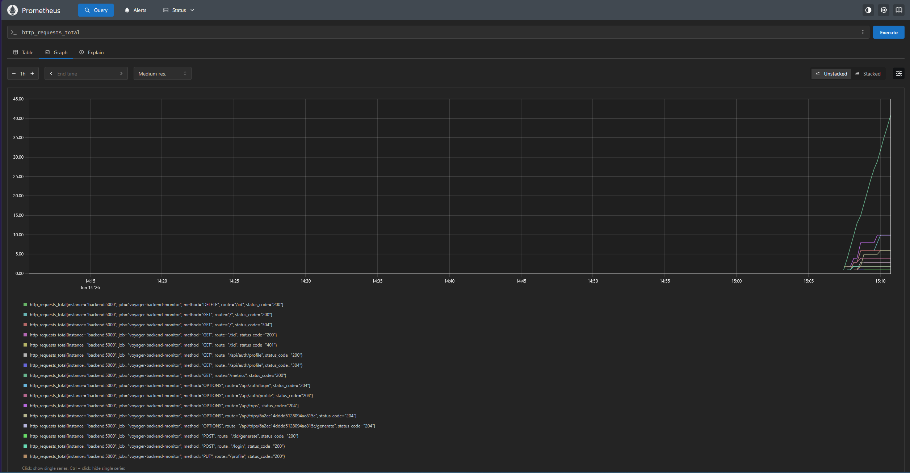

# Smart Voyager - Inteligentny Planer Podróży AI

Smart Voyager to zaawansowany ekosystem aplikacji (Web + Mobile) rewolucjonizujący proces planowania podróży. Dzięki integracji z modelami LLM, system automatycznie generuje optymalne i spersonalizowane trasy na podstawie budżetu, zainteresowań oraz kryteriów logistycznych wprowadzonych przez użytkownika.

## Stan projektu & Finalne Funkcjonalności

Ekosystem został w pełni zaimplementowany i zintegrowany w architekturze klient-serwer.

### Rdzeń Backendowy & AI
* **Generowanie Tras AI:** Pełna integracja z Groq API (Llama 3.3). System przeprowadza wielowymiarową analizę preferencji i buduje gotowy plan podróży.
* **Autoryzacja & RBAC:** Zaawansowany system ról (User, Admin). Rejestracja i logowanie zabezpieczone tokenami JWT oraz szyfrowaniem haseł (bcrypt).
* **Kaskadowe Usuwanie Danych:** Usunięcie konta lub wycieczki automatycznie i permanentnie czyści powiązane z nimi elementy w bazie danych (User -> Trips -> Waypoints).
* **Automatyczne Wyliczanie Czasu:** Wykorzystanie mechanizmów `virtuals` w Mongoose do dynamicznego kalkulowania czasu trwania wycieczek.

### Aplikacja Webowa (React)
* **Panel Użytkownika:** Pełne zarządzanie wycieczkami (CRUD), przeglądanie wygenerowanych planów oraz interaktywna oś czasu przystanków.
* **Panel Administracyjny:** Dedykowany moduł dla roli Admin umożliwiający globalny wgląd w statystyki systemu, zarządzanie uprawnieniami użytkowników oraz monitoring wszystkich punktów trasy.

### Aplikacja Mobilna (React Native)
* **Mobilny Asystent Podróży:** Podgląd zaplanowanych tras na żywo w podróży, zarządzanie stanem punktów (oznaczanie jako odwiedzone) przy użyciu globalnego stanu Zustand.

### Infrastruktura & DevOps
* **Konteneryzacja:** Kompletny stos technologiczny spięty w zoptymalizowanych kontenerach Docker.
* **Monitoring i Logowanie:** Zbieranie metryk systemowych (Prometheus) oraz ustrukturyzowane logowanie błędów w czasie rzeczywistym po stronie serwera.

## Technologie
* **Backend:** Node.js, Express, JWT, MongoDB, Mongoose
* **Infrastruktura & Monitoring:** Docker, Docker Compose, Prometheus, Grafana k6
* **Frontend Web:** React, TypeScript, Axios, Vite
* **Frontend Mobile:** React Native (Expo), TypeScript, Zustand
* **AI Integration:** Groq API (Llama 3.3)

## Backend API (Endpointy)

### Inteligentne Planowanie AI & Monitoring
| Metoda | Endpoint | Opis | Uprawnienia |
| :--- | :--- | :--- | :--- |
| POST | `/api/trips/:id/generate` | Generuje nową trasę przy użyciu AI na podstawie preferencji | Użytkownik |
| DELETE | `/api/trips/:id/waypoints` | Czyści wszystkie punkty z danej wycieczki | Użytkownik |
| GET | `/metrics` | Endpoint metryk aplikacyjnych dla systemu Prometheus | Systemowe |

### Uwierzytelnianie i Profil (`/api/auth`)
| Metoda | Endpoint | Opis | Uprawnienia |
| :--- | :--- | :--- | :--- |
| POST | `/api/auth/register` | Rejestracja nowego użytkownika | Publiczne |
| POST | `/api/auth/login` | Logowanie i zwrot tokena JWT | Publiczne |
| GET | `/api/auth/profile` | Pobranie danych profilu | Użytkownik |
| PUT | `/api/auth/profile` | Aktualizacja danych własnego profilu | Użytkownik |

### Wycieczki & Punkty Trasy (`/api/trips`)
| Metoda | Endpoint | Opis | Uprawnienia |
| :--- | :--- | :--- | :--- |
| GET | `/api/trips` | Pobranie własnych wycieczek z przystankami | Użytkownik |
| POST | `/api/trips` | Utworzenie nowej wycieczki | Użytkownik |
| DELETE | `/api/trips/:id` | Usunięcie wycieczki (Kaskadowe czyszczenie) | User/Admin |
| GET | `/api/trips/:tripId/waypoints`| Lista przystanków dla danej wycieczki | User/Admin |
| PUT | `/api/trips/waypoints/:id` | Aktualizacja punktu (np. visited: true) | Użytkownik |
| GET | `/api/trips/admin/all` | Globalny podgląd wszystkich wycieczek | **Admin** |

### Zarządzanie użytkownikami (`/api/users`) - *Tylko dla Administratora*
| Metoda | Endpoint | Opis |
| :--- | :--- | :--- |
| GET | `/api/users` | Lista wszystkich zarejestrowanych użytkowników |
| GET | `/api/users/stats` | Statystyki systemowe (liczba kont i aktywnych tras) |
| PUT | `/api/users/:id/role` | Zmiana uprawnień (User <-> Admin) |
| DELETE | `/api/users/:id` | Usunięcie konta i danych kaskadowo |

## Struktura Projektu
* `/web` - Aplikacja webowa (React + Vite)
* `/mobile` - Aplikacja mobilna (React Native + Expo)
* `/backend` - Serwer API (Node.js + Express)
* `/docs` - Dokumentacja projektowa, raporty z testów E2E i monitoringu
* `/tests-load` - Skrypty wydajnościowe i obciążeniowe k6

---

## Instrukcja Uruchomienia Produkcyjnego (Docker Compose)

W trybie produkcyjnym aplikacja działa w zoptymalizowanym środowisku: wyłączone są logi deweloperskie, ukryty jest pełny *stack trace* błędów przed użytkownikiem, a serwer korzysta z pełnej izolacji sieciowej kontenerów.

### 1. Wymagania wstępne:
* Zainstalowany i uruchomiony [Docker Desktop](https://www.docker.com/products/docker-desktop/)

### 2. Uruchomienie krok po kroku
1. Skonfiguruj plik `.env` w głównym katalogu projektu na podstawie pliku `.env.example`, upewniając się, że zmienna `NODE_ENV` jest ustawiona na `production` oraz podane są poprawne klucze autoryzacyjne.
2. Uruchom terminal w głównym katalogu projektu i zbuduj kontenery produkcyjne:
```bash
   docker compose up --build -d
```

## Weryfikacja Działania i Adresy URL

Po udanym wdrożeniu produkcyjnym, poszczególne moduły systemu oraz narzędzia DevOps są dostępne w przeglądarce pod poniższymi adresami:

| Komponent Systemu | Adres URL docelowy | Opis działania | Dane dostępowe |
| :--- | :--- | :--- | :--- |
| **Frontend Web** | `http://localhost:5173` | Panel kliencki oraz widok Admina (React) | `admin@voyager.pl` / `Haslo123!` |
| **Backend API Server** | `http://localhost:5000` | Główny serwer Express REST API | Środowisko: `production` |
| **Surowe Metryki** | `http://localhost:5000/metrics` | Punkt poboru danych aplikacji dla Prometheusa | Publiczne / Systemowe |
| **Panel Prometheus** | `http://localhost:9090` | Panel monitorowania wydajności i statystyk żądań | Systemowe |

## Znane Ograniczenia (Known Limitations)

* **Zależność od zewnętrznego API:** Moduł generowania tras jest ściśle uzależniony od stabilności, czasu odpowiedzi oraz limitów żądań (*rate limits*) zewnętrznego dostawcy Groq API. W przypadku braku ważnego klucza lub przeciążenia serwerów zewnętrznych, funkcja ta będzie niedostępna.
* **Sztuczne generowanie współrzędnych geograficznych:** Punkty trasy (*waypoints*) tworzone przez model LLM posiadają poprawne logicznie nazwy, opisy oraz kolejność, jednak w obecnej fazie projektu nie są one mapowane na realne współrzędne GPS w czasie rzeczywistym.

## Prezentacja Systemu (Screenshoty / Demo)

*Poniższe zrzuty ekranu przedstawiają gotowy, działający system Smart Voyager oraz infrastrukturę monitoringu w środowisku produkcyjnym:*

### 1. Panel Główny Web aplikacji
* **Wymagana ścieżka pliku:** `docs/screenshots/web_main_panel.png`
  

### 2. Kreator wycieczek — Konfiguracja i parametry logistyczne
*Służy do wprowadzania podstawowych danych wycieczki, takich jak ramy czasowe, lokalizacja bazowa oraz budżet.*
* **Wymagana ścieżka pliku:** `docs/screenshots/web_new_trip_form.png`
  

### 3. Panel osobistych preferencji i rekomendacji miejsc AI
*Miejsce, w którym użytkownik definiuje swoje zainteresowania, styl podróżowania oraz wymagania specjalne, na podstawie których Groq (Llama 3.3) dobiera polecane atrakcje.*
* **Wymagana ścieżka pliku:** `docs/screenshots/web_ai_preferences.png`
  

### 4. Wygenerowana trasa i plan podróży (Widok Mapy / Oś czasu)
*Efekt końcowy działania modułu AI — ustrukturyzowana i posortowana chronologicznie lista przystanków (waypoints) wstrzyknięta do bazy danych.*
* **Wymagana ścieżka pliku:** `docs/screenshots/web_generated_map.png`
  

### 5. Panel Profilu Użytkownika
*Widok pozwalający na wgląd w dane konta, zmianę haseł oraz zarządzanie profilem podróżnika zabezpieczonym przez JWT.*
* **Wymagana ścieżka pliku:** `docs/screenshots/web_user_profile.png`
  

### 6. Panel Administracyjny (Zarządzanie i Statystyki)
* **Wymagana ścieżka pliku:** `docs/screenshots/web_admin_panel.png`
  

### 7. Wykresy Wydajności w Systemie Prometheus (Metryki E2E)
* **Wymagana ścieżka pliku:** `docs/screenshots/metryki_prometheus.png`
  